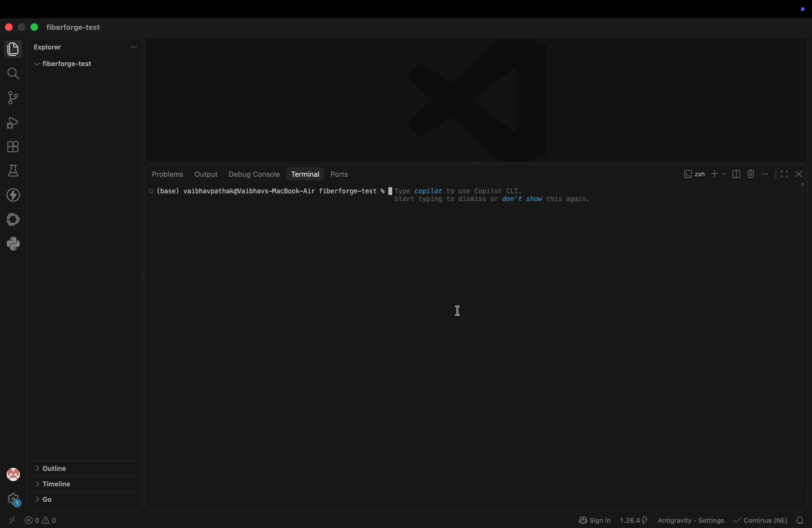

# FiberForge ⚡

> [!WARNING]
> **DEVELOPMENT PHASE ONLY - NOT SAFE FOR PRODUCTION**
> 
> FiberForge is currently in early active development. **Do not use this package on any existing project or computer you care about.** While critical bugs (like destructive directory wiping) have been patched, the tool is highly experimental and may still behave unpredictably. It is meant for initial boilerplate generation in isolated sandbox environments. We are actively looking for contributors and code reviews to improve stability. Use at your own risk!

**FiberForge** (`fiberforge`) is a high-performance Go CLI and MCP server that generates complete **Go Fiber (v2)** REST API backends from a declarative YAML or JSON schema.

Give it a schema describing your domain entities and features, and FiberForge scaffolds clean, deterministic code: GORM/MGM database models, business logic services, Fiber controllers, JWT authentication, versioned SQL migrations, Swagger docs, Docker containerization, structured `log/slog` logging, graceful shutdown, health probes, and unit tests.

> **Design Principle**: *AI agents write the schema; FiberForge renders deterministic, 100% compilable Go code in 50 milliseconds.*



---

## Why FiberForge? (Token Efficiency & Speed)

When using AI coding assistants (Cursor, Claude Code, Windsurf, Antigravity) to build backends, asking an LLM to write Go boilerplate line-by-line is slow, expensive, and quickly fills up your context window.

FiberForge shifts code generation from token-by-token LLM streaming to **deterministic, instant Go template rendering**:

| Metric | LLM Manual Code Writing | FiberForge MCP Engine | Saving / Improvement |
|:---|:---|:---|:---|
| **Output Token Count** | ~17,500 tokens | **~150 tokens** | **99.1% Token Reduction** (~17,350 tokens saved per app) |
| **Generation Latency** | 180 – 240 seconds (3-4 mins) | **~0.05 seconds (50ms)** | **~3,600x Speedup** |
| **LLM Output Cost** | ~$0.26 per app | **~$0.002 per tool call** | **99% Cost Reduction** |
| **Context Window Impact** | Fills context window with ~18k tokens of repetitive code | Keeps context clean (only stores schema & file list) | **Preserves context window for real business logic** |
| **Code Correctness** | High risk of broken routes, missing imports, or invalid tags | **100% Compilable & `gofmt`-verified Go code** | Zero syntax hallucinations |

---

## Features

- **Databases**: PostgreSQL, MySQL, MongoDB (GORM for SQL, `mgm` for Mongo).
- **Framework**: Go Fiber (v2) with Go 1.23+ generated code.
- **Opt-in Features**: `auth` (JWT), `docker`, `migrations`, `swagger`, `rateLimit`, `cors`, `logging`, `testing`, `ci`.
- **Relationships**: First-class support for `belongsTo`, `hasMany`, and `manyToMany` graph relations with foreign key indices and migration join tables.
- **Production-Grade Infrastructure**:
  - Structured JSON logging (`log/slog`) with request ID correlation.
  - Graceful shutdown (`signal.NotifyContext` + `app.ShutdownWithTimeout`).
  - Kubernetes/Cloud probes: `/health/live` and `/health/ready` (with DB ping).
  - Configurable database connection pooling.
  - Docker Compose with container healthchecks.
  - GitHub Actions CI workflow with `golangci-lint` and race-detector testing.
- **Dual Mode (Single Binary)**:
  - CLI mode (`fiberforge scaffold`, `fiberforge init`, `--dry-run`).
  - Agentic MCP server (`fiberforge serve`) exposing 5 tools over stdio JSON-RPC 2.0.

---

## Installation

### Via NPM / NPX (Recommended for quick start)
You don't even need Go installed to use FiberForge. Just run it via `npx`:
```bash
npx fiberforge-cli init
```

### Via Go
```bash
go install github.com/v-pat/fiberforge@latest
```

### From Source
```bash
git clone https://github.com/v-pat/fiberforge.git
cd fiberforge
go build -o fiberforge .
```

---

## Usage

### 1. Interactive TUI Wizard (`fiberforge init`)

Launch an interactive terminal UI powered by Charm's `huh` to configure your app, pick features, and build models visually:

```bash
fiberforge init
```

Generates a `fiberforge.yaml` schema and offers to scaffold immediately.

### 2. CLI Scaffold (`fiberforge scaffold`)

Scaffold a project deterministically from a schema file:

```bash
fiberforge scaffold examples/blog.yaml
fiberforge scaffold examples/ecommerce.yaml --output-dir /tmp/my-store
```

Preview generated files without touching disk:

```bash
fiberforge scaffold examples/blog.yaml --dry-run
```

### 3. AI Agent MCP Server (`fiberforge serve`)

Run FiberForge as a Model Context Protocol (MCP) server over stdio for AI coding agents (**Claude Code**, **Cursor**, **Cline**, **Windsurf**, **opencode**):

```bash
fiberforge serve
```

#### MCP Client Configuration

Add FiberForge to your editor's MCP config:

**Cursor (`.cursor/mcp.json`) / Claude Code (`mcp.json`)**:

```json
{
  "mcpServers": {
    "fiberforge": {
      "command": "npx",
      "args": ["-y", "fiberforge-cli", "serve"]
    }
  }
}
```

*(If you installed via Go, you can use `"command": "fiberforge", "args": ["serve"]` instead)*

**opencode (`.opencode.json`)**:

```json
{
  "mcp": {
    "fiberforge": {
      "type": "local",
      "command": ["npx", "-y", "fiberforge-cli", "serve"]
    }
  }
}
```

#### AI Agent Skill (`SKILL.md` / Cursor Rules)

Want your AI coding assistant (Cursor, Antigravity, Claude Code) to automatically use FiberForge whenever you ask for a Go backend?

- **Cursor**: Copy [`.cursor/rules/fiberforge.mdc`](file:///Users/vaibhavpathak/Documents/fiberforge/.cursor/rules/fiberforge.mdc) into your project's `.cursor/rules/` directory.
- **Antigravity / General Agents**: Import [`skills/fiberforge/SKILL.md`](file:///Users/vaibhavpathak/Documents/fiberforge/skills/fiberforge/SKILL.md) into your skills library.

When active, your AI agent will design the schema and invoke `npx fiberforge-cli scaffold` or `generate_project` in 50ms instead of generating Go code manually line-by-line!

#### Exposed MCP Tools

| Tool | Description |
| :--- | :--- |
| `generate_project` | Generate a complete, compilable Go Fiber project from a YAML/JSON schema string. |
| `validate_schema` | Validate a schema string without generating files, reporting any semantic problems. |
| `get_schema_template` | Fetch a pre-built starter schema (`blog`, `ecommerce`, `saas`, `social`) to customize. |
| `list_field_types` | List all supported field types, options, database drivers, and relationship kinds. |
| `explain_project` | Dry-run a schema to inspect the exact file tree, models, and endpoints it produces. |

---

## Schema Reference

YAML is primary; JSON is also supported.

```yaml
appName: blog
framework: fiber            # optional, defaults to fiber
database: postgres          # postgres | mysql | mongodb
port: 8080                  # optional, defaults to 8080

env:                        # optional custom environment variables
  STRIPE_KEY: sk_test_123

features:
  auth: true                # JWT authentication (auto User model, /register, /login, /me, /refresh)
  docker: true              # Multi-stage Dockerfile + docker-compose with healthchecks
  migrations: true          # Versioned SQL migrations (.up.sql / .down.sql) + Makefile runner
  swagger: true             # OpenAPI 3.0 specification (docs/swagger.json)
  rateLimit: true           # Sliding-window rate limiter middleware
  cors: true                # Configurable CORS middleware
  logging: true             # Fiber request logger middleware
  testing: true             # Controller & Auth smoke tests
  ci: true                  # GitHub Actions CI workflow (golangci-lint + test -race)

models:
  - name: user
    endpoint: users
    auth: true              # protect this model's routes with JWT middleware
    tableName: account_users # optional explicit table/collection override
    fields:
      - name: email
        type: string
        required: true
        unique: true
        validation: email
      - name: password
        type: password
        required: true
        sensitive: true     # never serialized in JSON (json:"-")
      - name: role
        type: enum
        values: [admin, member, guest]

  - name: post
    endpoint: posts
    fields:
      - name: title
        type: string
        required: true
      - name: content
        type: text
      - name: views
        type: int
        default: "0"
    relationships:
      - type: belongsTo
        model: user
      - type: manyToMany
        model: tag

  - name: tag
    endpoint: tags
    fields:
      - name: name
        type: string
        required: true
        unique: true
```

### Supported Field Types

`string`, `text`, `int`, `int64`, `float`, `bool`, `time`, `uuid`, `json`, `enum` (with `values`), `password` (bcrypt hashed).

### Supported Field Options

`required`, `unique`, `default`, `validation`, `sensitive`, `index`, `jsonTag`, `omitempty`, `values`.

### Relationships

- `belongsTo`: Injects foreign key (`<Model>ID`) + association field (`<Model>`).
- `hasMany`: Injects association slice (`[]<Model>`).
- `manyToMany`: Injects association slice (`[]<Model>`) + generates SQL join table migration (`<self>_<target>`).

---

## Pre-Built Schema Gallery

Explore real-world starter schemas in the `examples/` directory:

- `examples/blog.yaml`: Publishing platform with authors, posts, tags, JWT auth, PostgreSQL, and Swagger.
- `examples/ecommerce.yaml`: E-commerce catalog with products, categories, orders, PostgreSQL, and rate limiting.
- `examples/saas.yaml`: Multi-tenant SaaS structure with organizations, subscriptions, PostgreSQL, and CORS.
- `examples/social.yaml`: Social feed with posts, comments, MongoDB, and rate limiting.

---

## Generated Project Layout

```
blog/
├── go.mod / README.md / .gitignore / .env.example
├── main.go                     # App bootstrap (slog, requestid, graceful shutdown)
├── config/config.go            # Env loader with dynamic defaults
├── databases/db.go             # Database connection, pooling, AutoMigrate & Ping()
├── model/*.go                  # GORM / mgm struct definitions with tags
├── service/*.go                # Business logic CRUD handlers
├── controller/*.go             # HTTP handlers with request validation
├── routes/routes.go            # Route registration & health probes (/health/live, /health/ready)
├── auth/                       # JWT token creation, password hashing, user store (when auth: true)
├── middleware/jwt.go           # Fiber JWT authentication middleware (when auth: true)
├── migrations/                 # Up & down SQL migration scripts (when migrations: true)
├── docs/swagger.json           # OpenAPI 3.0 document (when swagger: true)
├── Dockerfile, docker-compose.yml, Makefile
└── .github/workflows/ci.yml    # GitHub Actions workflow
```

---

## Testing FiberForge

Run all unit tests (schema validation, engine code generation, MCP protocol):

```bash
go test ./...
```

---

## License

MIT License. See [LICENSE](LICENSE) for details.